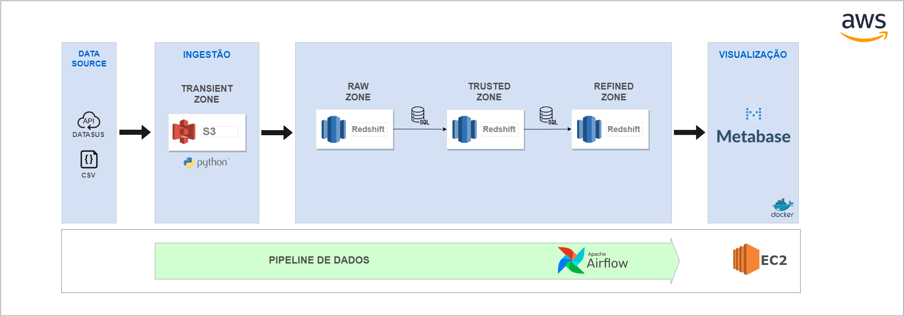
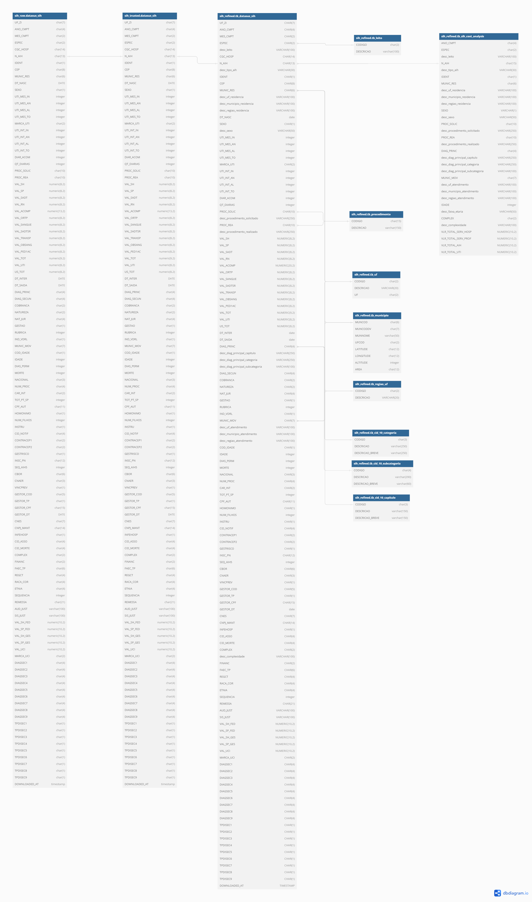

# PIPELINE DE DADOS PARA ANÁLISE DE INTERNAÇÕES HOSPITALARES DO SISTEMA ÚNICO DE SAÚDE (SUS)
Pipeline de dados desenvolvida utilizando dados de internações do DataSUS como origem.

> Os dados são obtidos utilizando a biblioteca [PySUS](https://pysus.readthedocs.io/pt/latest/).

Logo abaixo o desenho da infraestrutura utilizada:

 
 
- 1 - Cloud: AWS
- 2 - Armazenamento:  Amazon S3, Amazon Reshift
- 3 - Visualização: Metabase
- 4 - Gerenciamento de workflow: Apache Airflow

Modelagem do banco de dados:
